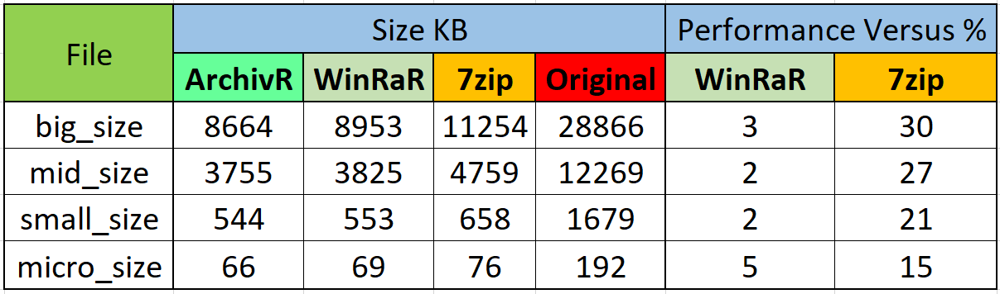

# ArchivR

Compressing utility which achieves **better compression** ratio than **7Zip** or **WinRaR**.


## Details

ArchivR achieves very good compression ratio thanks to its 3 main components the **Burrows–Wheeler transform**, **Move2Front Encoding** and **Huffman compresion**. The first one rearanges an input stream in such a way that series of specific character occur very close to eachother. Having fed the output of the first algorithm into the M2F encoding, a new stream is obtained through rearangement where certain characters appear more often than others. The last step is the application of Huffman compression. At the center of these manipulations, during compression and decompression, Circular-Suffix-Array plays a vital role in the efficiency and speed of the ArchivR utility.


## Performance

As can be seen below, ArchivR significantly **outperforms** 7Zip and still manages to do slightly better than WinRaR.




## Demo
**Compression Followed by Decompression compared to WinRar and 7Zip**


## Package

- MoveToFront encoder and decoder
- Burrows–Wheeler direct and inverse transformer
- Test files with different sizes are located in the test folder

## Usage

- CD to the `ArchivR` folder.

- Compile
```shell
C:\ArchivR> javac -cp "C:\ArchivR;C:\ArchivR\test;C:\ArchivR\lib\algs4.jar" BurrowsWheeler.java
C:\ArchivR> javac -cp "C:\ArchivR;C:\ArchivR\test;C:\ArchivR\lib\algs4.jar" MoveToFront.java
C:\ArchivR> javac -cp "C:\ArchivR;C:\ArchivR\test;C:\ArchivR\lib\algs4.jar" CircularSuffixArray.java
```

- Compreesion with options `input_file` and `output_file`

```shell
C:\ArchivR> java -cp "C:\ArchivR;C:\ArchivR\lib\algs4.jar" BurrowsWheeler - < test\input_file | java -cp "C:\ArchivR;C:\ArchivR\lib\algs4.jar" MoveToFront - | java -cp "C:\ArchivR;C:\ArchivR\lib\algs4.jar" edu.princeton.cs.algs4.Huffman - > test\output_file
```

- Decompreesion with options `input_file` and `output_file`

```shell
C:\ArchivR> java -cp "C:\ArchivR;C:\ArchivR\lib\algs4.jar" edu.princeton.cs.algs4.Huffman + < test\input_file | java -cp "C:\ArchivR;C:\ArchivR\lib\algs4.jar" MoveToFront + | java -cp "C:\ArchivR;C:\ArchivR\lib\algs4.jar" BurrowsWheeler + > test\output_file
```

## How to Contribute

1. Clone repo and create a new branch: `$ git checkout https://github.com/DumitruHanciu/ArchivR -b new_branch`.
2. Make changes and test
3. Submit Pull Request with comprehensive description of changes


## License

[](http://badges.mit-license.org)

- **[MIT license](http://opensource.org/licenses/mit-license.php)**
